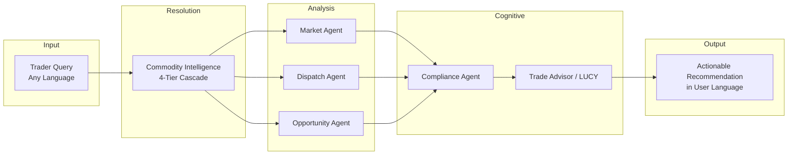
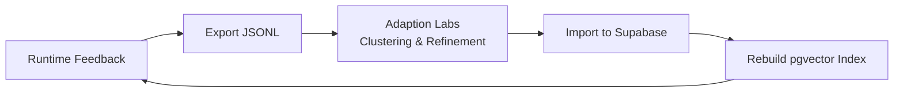

# TradeNexus

**Multilingual Commodity Intelligence and CTRM Platform for Indian Markets**

TradeNexus is a production-oriented commodity intelligence layer built for Indian agricultural and commodity traders. It resolves regional language fragmentation, aggregates mandi-level market signals, and orchestrates 20+ specialized AI agents to deliver actionable recommendations on where to sell, when to dispatch, and how to manage contracts, risk, and compliance.

**Live Demo:** [https://tradenexus.vercel.app](https://tradenexus.vercel.app)

## Table of Contents

- [Executive Summary](#executive-summary)
- [Problem Statement](#problem-statement)
- [Solution](#solution)
- [Technical Highlights](#technical-highlights)
- [Key Features](#key-features)
- [System Architecture](#system-architecture)
- [AI Agent Framework](#ai-agent-framework)
- [Linguistic Resolution Cascade](#linguistic-resolution-cascade)
- [Adaptive Learning with Adaption Labs](#adaptive-learning-with-adaption-labs)
- [Technology Stack](#technology-stack)
- [Datasets and Data Sources](#datasets-and-data-sources)
- [Project Structure](#project-structure)
- [API Surface](#api-surface)
- [Setup and Local Development](#setup-and-local-development)
- [Environment Variables](#environment-variables)
- [Documentation](#documentation)
- [Roadmap](#roadmap)
- [License](#license)

---

## Executive Summary

Indian commodity trading operates across thousands of regional mandis where the same crop may have dozens of names across Hindi, Marathi, Gujarati, Telugu, Tamil, and other languages. Price discovery, logistics planning, and regulatory compliance are fragmented across disconnected systems.

TradeNexus unifies these workflows into a single platform:

| Capability | Description |
|---|---|
| **Multilingual Intelligence** | Resolves regional commodity names to canonical forms via a 4-tier cascade (SQL, trigram, vector, LLM) |
| **Market Analytics** | Ingests live mandi prices from data.gov.in with Redis caching and anomaly detection |
| **Trade Optimization** | Identifies arbitrage corridors, dispatch timing, and net-margin destinations |
| **CTRM Operations** | Manages contracts, dispatches, inventory, mark-to-market P&L, and counterparty risk |
| **Conversational AI** | LUCY (Natural Language OS) and Copilot provide voice/text orchestration across all modules |
| **Continuous Adaptation** | Offline pipeline refines alias and intent datasets via Adaption Labs SDK |

The platform follows a **deterministic-first, single-pass LLM synthesis** design: fast statistical agents run in parallel, and a cognitive agent performs one LLM call to synthesize the final recommendation—minimizing latency and API cost.

---

## Problem Statement

Agricultural commodity trading in India faces structural inefficiencies:

```
Regional Query          Fragmented Data           Operational Gap
─────────────────       ─────────────────         ─────────────────
"Kapas ka bhav?"   -->  7,000+ mandis         -->  Missed arbitrage
"Kaapus rate?"          20+ languages             Delayed dispatch
"Paruthi price?"        No unified search         Compliance risk
```

**Language fragmentation.** Cotton is Kapas (Hindi), Kaapus (Marathi), Kapas (Gujarati), Patti (Telugu), and Paruthi (Tamil). Traders search in their native dialect; most platforms only accept English canonical names.

**Opaque price discovery.** Mandi prices vary significantly by state and corridor. Net margin depends on geographic spreads minus transport cost, transit time, and corridor reliability—calculations traders often perform manually.

**Logistics complexity.** Interstate movement requires route planning, delay-risk assessment, and weather-aware scheduling across unreliable transport corridors.

**Regulatory friction.** APMC permits, FSSAI standards, GST e-way bills, and interstate cess requirements vary by commodity and corridor.

**Operational risk.** Contract lifecycle, inventory positions, counterparty exposure, and mark-to-market P&L are typically managed in spreadsheets disconnected from market intelligence.

---

## Solution

TradeNexus addresses these gaps through a hybrid multi-agent architecture:



1. **Normalize input** — Regional commodity terms resolve to canonical names in under 100 ms for 95%+ of queries (Tiers 1–3).
2. **Analyze in parallel** — Deterministic agents compute mandi prices, corridor scores, and arbitrage spreads simultaneously.
3. **Validate compliance** — LLM agent extracts permit and regulatory requirements for the origin–destination pair.
4. **Synthesize once** — A single LLM pass produces an executive recommendation with structured telemetry from all agents.
5. **Adapt continuously** — User corrections and LLM-inferred aliases feed an offline Adaption Labs pipeline that improves future resolution accuracy.

---

## Technical Highlights

TradeNexus is built around six core technical differentiators:

### Retrieval-Augmented Generation (RAG)

A **1,632-example multilingual intent corpus** (9 Indian languages + Hinglish) is embedded using `paraphrase-multilingual-MiniLM-L12-v2` and indexed in Supabase pgvector. At query time, the `IntentRetriever` performs semantic search to retrieve the top-3 similar trader utterances and injects them as few-shot examples into the LLM classifier — grounding intent decisions in real regional language patterns rather than zero-shot guessing.

```
User Query → Embedding → Vector Search → Similar Examples → Intent Classification → Agent Routing
```

### Multilingual NLP

Two vector-indexed NLP layers share the same 384-dimensional multilingual embedding model:

| Layer | Index | Purpose |
|---|---|---|
| Commodity resolution | `commodity_aliases` (639+ rows) | Tier 3 of the 4-tier linguistic cascade |
| Intent classification | `intent_examples` (1,632 rows) | RAG retrieval for Copilot and LUCY |

Cross-lingual retrieval allows a Hindi query ("kapas ka bhav") to match corpus entries in any supported script or transliteration.

### Embeddings

- **Model:** `paraphrase-multilingual-MiniLM-L12-v2` (sentence-transformers, local inference)
- **Dimensions:** 384
- **Storage:** Supabase pgvector with IVFFlat cosine indexes
- **Cost:** Zero API cost — all encoding runs locally on the backend

### Machine Learning — LSTM and XGBoost

| Model | Role |
|---|---|
| **LSTM** (TensorFlow) | 21-day input window → 7-day mandi price forecast per commodity |
| **XGBoost** (price) | Feature-based regression with lag prices and rolling statistics |
| **XGBoost** (risk) | Counterparty default probability classifier |
| Prophet / Chronos | Seasonal decomposition and zero-shot fallback for cold-start commodities |

Models lazy-load on first forecast request via `MLInferenceAgent`. Training scripts live in `services/ml/`.

### Agent Orchestration

20 specialized agents execute in a **deterministic-first, single-pass LLM synthesis** pattern:

- Zero-LLM agents (Market, Dispatch, Opportunity, Risk) run in parallel
- Structured telemetry feeds one cognitive agent for final synthesis
- LUCY orchestrates 21 intents across 8+ agents with session memory and pronoun resolution
- Copilot routes 8 coarse intents to handler functions with execution timeline tracking

See [docs/SYSTEM_ARCHITECTURE.md](docs/SYSTEM_ARCHITECTURE.md) for full agent routing maps and sequence diagrams.

---

## Key Features

### Market Intelligence

- Live mandi price ingestion from **data.gov.in** (AGMARKNET resource) for 20 tracked commodities
- Price trend analysis, min/max/modal metrics, and statistical anomaly detection
- Market alerts for demand spikes, price drops, and arbitrage windows
- Redis-backed caching (4-hour TTL) for sub-second repeat queries

### Dispatch and Logistics

- Corridor scoring using **Google Routes API v2** and pre-seeded trade corridor database
- Distance, duration, reliability score, and delay-risk categorization
- Dispatch creation, tracking, and status management

### Opportunity Discovery

- Geographic arbitrage scanning across interstate corridors
- Net-margin calculation accounting for transport cost and corridor reliability
- Buyer discovery ranked by geography and commodity match

### Compliance and Document Processing

- APMC, FSSAI, and GST requirement extraction via LLM
- PDF/image OCR for invoices, e-way bills, and field notes (PyMuPDF + Tesseract)
- GST invoice generation and HSN lookup

### CTRM (Commodity Trading and Risk Management)

- Contract lifecycle management (create, status transitions, field-note parsing)
- Inventory tracking and mark-to-market P&L snapshots
- Counterparty risk scoring and portfolio concentration analysis
- Quality lot inspection records
- D3-powered supply chain network visualization

### Risk and Forecasting

- Background schedulers: hourly risk recalculation, daily weather and macro scans
- ML price forecasting via LSTM, Prophet, XGBoost, LightGBM, and Chronos models
- Weather risk signals from **Open-Meteo** for active corridors
- Macro sentiment analysis for open contract commodities

### Conversational Interfaces

| Interface | Entry Point | Capabilities |
|---|---|---|
| **Trade Advisor** | `/app/advisor` | One-shot trade recommendation from commodity + origin query |
| **Copilot** | Page-level panel | Voice/text intent routing with execution timeline and TTS response |
| **LUCY** | Global overlay | 21-intent Natural Language OS with session memory, pronoun resolution, and CTRM actions |

Supported UI languages: English and Hindi (i18next). Speech recognition via Web Speech API.

### Learning and Feedback

- User alias corrections upserted to database with embedding re-indexing
- LLM Tier-4 resolutions logged for future seed promotion
- Learning activity dashboard with resolution tier breakdown
- **RAG intent corpus:** 1,632 multilingual examples embedded and indexed for retrieval-augmented classification
- Intent corpus adaptation via Adaption Labs for improved Copilot/LUCY classification

---

## System Architecture

```
┌──────────────────────────────────────────────────────────────────────────┐
│                     Frontend — React 19 + Vite (Vercel)                   │
│  Dashboard │ Markets │ Dispatch │ Opportunities │ Advisor │ CTRM Modules │
│  LUCY (Global NL OS) │ Copilot (Voice/Text) │ i18n (EN/HI)               │
└─────────────────────────────────┬────────────────────────────────────────┘
                                  │ REST /api/v1/*
┌─────────────────────────────────▼────────────────────────────────────────┐
│                        Backend — FastAPI (Python 3.11+)                   │
│  14 Routers │ 20 Agents │ APScheduler │ Session Manager │ Intent RAG      │
└───────┬─────────────┬─────────────┬─────────────┬────────────────────────┘
        │             │             │             │
   Supabase      Upstash Redis   External APIs   ML Models
   PostgreSQL    (cache/TTL)     data.gov.in     LSTM/Prophet/
   pgvector                      Google Routes   XGBoost/Chronos
   pg_trgm                       Nvidia LLM
                                 Open-Meteo
```

For detailed component diagrams, agent flows, database schema, and deployment topology, see **[docs/SYSTEM_ARCHITECTURE.md](docs/SYSTEM_ARCHITECTURE.md)**.

---

## AI Agent Framework

TradeNexus implements **20 specialized agents** organized into three execution tiers:

| Tier | Agents | Execution Model |
|---|---|---|
| **Deterministic** | Market, Dispatch, Opportunity, Inventory, Buyer Discovery, Risk, Weather, Invoice, Counterparty | Zero-LLM statistical and rule-based computation |
| **Hybrid** | Commodity Intelligence, Contract, ML Inference, Ingestion | Deterministic core with LLM fallback or enrichment |
| **Cognitive** | Compliance, Trade Advisor, Intent Classifier, LUCY Orchestrator, Macro Signal | Nvidia LLM synthesis and classification |

### Primary Trade Recommendation Flow

```
User Query
    │
    ▼
CommodityAgent (4-tier resolution)
    │
    ├──► MarketAgent ──────────┐
    ├──► DispatchAgent ────────┤  Parallel execution
    └──► OpportunityAgent ─────┘
                │
                ▼
        ComplianceAgent (LLM)
                │
                ▼
        TradeAdvisorAgent (LLM synthesis)
                │
                ▼
        Executive Report
```

### LUCY Intent Coverage (21 intents)

`INVENTORY_ADD` · `INVENTORY_CHECK` · `INVENTORY_SELL` · `MARKET_QUERY` · `DISPATCH_QUERY` · `RECOMMENDATION` · `BUYER_SEARCH` · `DEAL_ANALYSIS` · `COMPLIANCE_QUERY` · `LEARNING_QUERY` · `GREETING` · `CONTRACT_CREATE` · `CONTRACT_STATUS` · `PNL_QUERY` · `RISK_QUERY` · `DISPATCH_CREATE` · `WEATHER_QUERY` · `FORECAST_QUERY` · `DOCUMENT_PARSE` · `UNKNOWN`

---

## Linguistic Resolution Cascade

TradeNexus resolves agricultural dialects without incurring LLM latency on every query:

```
Tier 1: SQL Exact Match          ~5 ms    (case-insensitive alias lookup)
   │ miss
   ▼
Tier 2: Trigram Similarity       ~15 ms   (pg_trgm spelling variants)
   │ miss
   ▼
Tier 3: Vector Semantic Search   ~40 ms   (384-dim multilingual embedding)
   │ miss
   ▼
Tier 4: Nvidia LLM Fallback      ~1.5 s   (qwen/qwen3.5-397b-a17b)
                                   └── logged to feedback loop for promotion
```

**Embedding model:** `paraphrase-multilingual-MiniLM-L12-v2` (384 dimensions), indexed in Supabase via `pgvector`.

**Seed coverage:** 639 alias rows across 10+ commodities in 9 languages (hi, mr, gu, te, ta, pa, bn, kn, en).

---

## Adaptive Learning with Adaption Labs

TradeNexus improves over time through a closed-loop adaptation pipeline powered by the **Adaption Labs SDK** (`adaption>=0.1.0`):



### Alias Adaptation Pipeline

| Step | Script | Action |
|---|---|---|
| 1. Export | `pipeline/export_aliases.py` | Dump user corrections and LLM-inferred aliases from Supabase |
| 2. Adapt | `pipeline/run_adaptation.py` | Submit dataset to Adaption Labs; cluster dialect variants |
| 3. Import | `pipeline/import_results.py` | Upsert refined mappings to `commodity_aliases` |
| 4. Rebuild | `services/api/scripts/build_embedding_index.py` | Sync pgvector embeddings |

### Intent Adaptation Pipeline

| Step | Script | Action |
|---|---|---|
| Generate | `pipeline/generate_intent_seeds.py` | Create multilingual intent utterance corpus |
| Prepare | `pipeline/prepare_intent_corpus.py` | Format corpus for adaptation |
| Adapt | `pipeline/run_intent_adaptation.py` | Refine intent examples via Adaption Labs |
| Import | `pipeline/import_intent_corpus.py` | Load refined examples into `intent_examples` |

Runtime feedback sources:
- **User corrections** via `POST /api/v1/feedback/correction` (source: `user`)
- **LLM-inferred aliases** from Tier 4 resolutions (source: `llm_inferred`)
- **RAG retrieval** via `core/intent_retriever.py` injects few-shot examples into classifiers

---

## Technology Stack

### Frontend (`apps/web/`)

| Category | Technology | Version |
|---|---|---|
| Framework | React | 19 |
| Build Tool | Vite | 6 |
| Routing | react-router-dom | 7 |
| Styling | Tailwind CSS | 3 |
| State | Zustand | 5 |
| HTTP Client | Axios | 1.7+ |
| i18n | i18next + react-i18next | EN / HI |
| Charts | Recharts, D3 | 2.15 / 7.9 |
| Animation | motion (Framer Motion) | 12 |
| Icons | lucide-react | 0.474 |
| Speech | Web Speech API | Browser-native |

### Backend (`services/api/`)

| Category | Technology | Version |
|---|---|---|
| API Framework | FastAPI | 0.115+ |
| Server | Uvicorn | 0.34+ |
| Validation | Pydantic v2 + pydantic-settings | 2.10+ |
| Database Client | supabase-py | 2.12+ |
| HTTP Client | httpx | 0.28+ |
| Scheduling | APScheduler | 3.11+ |
| Embeddings | sentence-transformers (`paraphrase-multilingual-MiniLM-L12-v2`, 384-dim) | 3.0+ |
| RAG Retrieval | pgvector + `IntentRetriever` (1,632-example intent corpus) | — |
| LLM | Nvidia AI Foundation Endpoints | qwen/qwen3.5-397b-a17b |
| OCR | PyMuPDF, pytesseract, Pillow | — |
| Adaptation | Adaption Labs SDK | 0.1+ |

### Machine Learning (`services/ml/`)

| Model | Use Case |
|---|---|
| LSTM (TensorFlow) | 21-day window → 7-day mandi price forecast per commodity |
| XGBoost (price) | Feature-based price regression with lag and rolling statistics |
| XGBoost (risk) | Counterparty default probability classification |
| Prophet | Seasonal trend decomposition |
| LightGBM | Gradient boosting alternative for price prediction |
| Chronos (HuggingFace) | Zero-shot time-series forecasting for cold-start commodities |

### Infrastructure and External Services

| Service | Role |
|---|---|
| **Supabase** (PostgreSQL) | Primary database with `pgvector` and `pg_trgm` extensions |
| **Upstash Redis** | Price caching (4h TTL), rate limiting |
| **data.gov.in** | Indian government mandi price data (AGMARKNET) |
| **Google Routes API v2** | Route distance, duration, traffic-aware routing |
| **Nvidia Build API** | LLM inference for cognitive agents |
| **Open-Meteo** | Weather forecasts for corridor risk assessment |
| **Adaption Labs** | Offline alias and intent dataset refinement |
| **Vercel** | Frontend hosting |

---

## Datasets and Data Sources

### Seed Data (`data/seeds/`)

| File | Records | Description |
|---|---|---|
| `commodity_aliases.csv` | 639 rows | Regional commodity names across 9 languages with confidence scores |
| `trade_corridors.csv` | 22 routes | Interstate corridors with distance, duration, and reliability scores |
| `buyers.csv` | 30 entries | Mills and buyers with geographic coordinates and commodity needs |
| `inventory.csv` | 5 items | Demo inventory for development and fallback |

### Database Schemas

| File | Scope |
|---|---|
| `data/schema.sql` | Core tables: commodities, aliases, mandi_prices, corridors, opportunities, feedback |
| `data/schema_ctrm.sql` | CTRM tables: contracts, dispatches, P&L, risk alerts, quality lots |
| `data/schema_intent.sql` | Intent RAG schema: 1,632 multilingual utterances with pgvector embeddings |

### External API Sources

| Source | Resource | Data Retrieved |
|---|---|---|
| data.gov.in | `9ef84268-d588-465a-a308-a864a43d0070` | Daily mandi min/max/modal prices |
| Google Routes v2 | `routes.googleapis.com` | Distance, duration, route geometry |
| Open-Meteo | Free weather API | 5-day regional forecasts |
| Nvidia LLM | `integrate.api.nvidia.com/v1` | Compliance, advisory, LUCY synthesis |

### Tracked Commodities (20)

Cotton · Wheat · Rice · Soybean · Turmeric · Chilli · Groundnut · Sugarcane · Onion · Mustard · Chickpea · Pigeon Pea · Maize · Sorghum · Pearl Millet · Sunflower · Tomato · Potato · Cumin · Coriander

### ML Training Artifacts

| Path | Contents |
|---|---|
| `data/ml_training/` | Per-commodity historical price CSV files |
| `data/ml_models/` | Trained model files and `model_registry.json` |
| `data/historical_cache/` | Cached historical price data |

---

## Project Structure

```
ai-agents-hackathon-2026-luna/
├── apps/web/                    # React 19 frontend
│   ├── src/
│   │   ├── pages/               # Landing, auth, app views
│   │   ├── components/
│   │   │   ├── ui/              # Card, Badge, gauges, stat cards
│   │   │   ├── layout/          # AppLayout, Sidebar, TopBar
│   │   │   ├── copilot/         # Voice copilot panel and timeline
│   │   │   └── lucy/            # LUCY global NL OS overlay
│   │   ├── hooks/               # useLucy, useSpeechRecognition
│   │   ├── store/               # Zustand state (global, copilot, lucy)
│   │   ├── lib/                 # API client, i18n config
│   │   ├── i18n/                # en.json, hi.json
│   │   └── data/demo.js         # Graceful fallback demo data
│   └── package.json
│
├── services/
│   ├── api/                     # FastAPI backend
│   │   ├── main.py              # App entry, CORS, scheduler lifecycle
│   │   ├── routers/             # 14 REST API routers
│   │   ├── agents/              # 20 AI agent modules
│   │   ├── core/                # Config, DB, LLM, embeddings, Redis, sessions
│   │   ├── data_ingestion/      # data.gov.in, Google Routes clients
│   │   ├── tasks/               # Background risk/weather/macro scheduler
│   │   └── scripts/             # Seeding, embedding index builds
│   └── ml/                      # Offline model training scripts
│
├── pipeline/                    # Adaption Labs offline pipelines
│   ├── export_aliases.py
│   ├── run_adaptation.py
│   ├── import_results.py
│   ├── run_intent_adaptation.py
│   └── output/                  # Generated JSONL (gitignored)
│
├── data/
│   ├── schema.sql               # Core database schema
│   ├── schema_ctrm.sql          # CTRM schema
│   ├── schema_intent.sql        # Intent RAG schema
│   └── seeds/                   # CSV seed files
│
├── docs/
│   └── SYSTEM_ARCHITECTURE.md   # Detailed architecture reference
│
├── .env.example
└── README.md
```

---

## API Surface

| Prefix | Endpoints | Domain |
|---|---|---|
| `/api/v1/market` | prices, alerts, ingest, commodities | Mandi data and anomalies |
| `/api/v1/dispatch` | score | Corridor routing analysis |
| `/api/v1/opportunity` | list, create | Arbitrage scanning |
| `/api/v1/compliance` | upload, parse-note, invoice, hsn-lookup | Regulatory and documents |
| `/api/v1/feedback` | correction, alert, stats | Learning loop |
| `/api/v1/advisor` | recommend | Trade recommendations |
| `/api/v1/copilot` | process | Voice/text copilot |
| `/api/v1/lucy` | chat, session/new, session/{id} | LUCY NL OS |
| `/api/v1/contracts` | CRUD, status, parse | Contract lifecycle |
| `/api/v1/counterparties` | list, create, risk | Counterparty management |
| `/api/v1/dispatches` | list, create, status | Dispatch tracking |
| `/api/v1/risk` | portfolio, mtm, alerts, forecast, weather, signals | Risk and ML |
| `/api/v1/network` | graph | Supply chain visualization |

Interactive API documentation: `http://localhost:8000/docs`

---

## Setup and Local Development

### Prerequisites

- Node.js 18+
- Python 3.11+
- npm
- Supabase project (PostgreSQL with `pgvector` and `pg_trgm` extensions)
- API keys (see [Environment Variables](#environment-variables))

### 1. Clone and Configure

```bash
git clone <repository-url>
cd ai-agents-hackathon-2026-luna
cp .env.example .env
# Populate .env with your API keys (see note on SUPABASE_KEY below)
```

### 2. Database Bootstrap

Run the following in the Supabase SQL Editor, in order:

1. `data/schema.sql`
2. `data/schema_ctrm.sql`
3. `data/schema_intent.sql`

Seed data and build embeddings:

```bash
cd services/api
python scripts/seed_demo_data.py
python scripts/build_embedding_index.py
```

### 3. Backend

```bash
cd services/api
python -m venv .venv

# Windows
.venv\Scripts\activate

# macOS / Linux
source .venv/bin/activate

pip install -r requirements.txt
uvicorn main:app --reload
```

- API: `http://localhost:8000`
- Health check: `http://localhost:8000/health`
- Swagger docs: "/docs"

### 4. Frontend

```bash
cd apps/web
npm install
npm run dev
```

- App: `http://localhost:5173`
- Vite proxies `/api` to `http://localhost:8000`

### 5. Optional — Adaptation Pipeline

```bash
python pipeline/export_aliases.py
python pipeline/run_adaptation.py
python pipeline/import_results.py
python services/api/scripts/build_embedding_index.py
```

### 6. Optional — ML Model Training

```bash
cd services/ml
python train_models.py
```

---

## Environment Variables

Configure a `.env` file at the project root:

| Variable | Required | Description |
|---|---|---|
| `SUPABASE_URL` | Yes | Supabase project URL |
| `SUPABASE_KEY` | Yes | Supabase anon or service role key |
| `UPSTASH_REDIS_REST_URL` | Recommended | Upstash Redis REST endpoint |
| `UPSTASH_REDIS_REST_TOKEN` | Recommended | Upstash authentication token |
| `NVIDIA_API_KEY` | For LLM features | Nvidia Build API key |
| `NVIDIA_MODEL` | No | Default: `qwen/qwen3.5-397b-a17b` |
| `LLM_PROVIDER` | No | `nvidia` or `mock` (for offline development) |
| `DATA_GOV_API_KEY` | Recommended | data.gov.in API key (falls back to mock prices) |
| `GOOGLE_ROUTES_API_KEY` | Recommended | Google Routes v2 (falls back to deterministic routes) |
| `ADAPTION_API_KEY` | For adaptation pipeline | Adaption Labs platform key |
| `INTERNAL_KEY` | For admin endpoints | Protects risk recalculation and pipeline hooks |
| `ENVIRONMENT` | No | `development`, `staging`, or `production` |

**Note:** Application code reads `SUPABASE_KEY`. If using `.env.example` as a template, map `SERVICE_ROLE_KEY` or `ANION_PUBLIC_KEY` to `SUPABASE_KEY`.

### Frontend (optional)

| Variable | Default | Description |
|---|---|---|
| `VITE_API_URL` | `http://localhost:8000` | Backend base URL |
| `VITE_INTERNAL_API_KEY` | — | Internal key for MtM recalculation calls |

---

## Documentation

| Document | Description |
|---|---|
| [docs/SYSTEM_ARCHITECTURE.md](docs/SYSTEM_ARCHITECTURE.md) | Full system architecture: RAG pipeline, multilingual NLP, embeddings, LSTM/XGBoost forecasting, agent orchestration, database schema, and deployment topology |

---

## Roadmap

| Phase | Status | Scope |
|---|---|---|
| **Phase 1: Foundation** | Complete | Monorepo scaffolding, UI patterns, schema routing, health checks |
| **Phase 2: Hybrid Agents** | Complete | Deterministic agents, Nvidia LLM integration, 4-tier cascade, Google Routes v2 |
| **Phase 3: Data Ingestion** | In Progress | Live data.gov.in pipelines, Redis caching optimization |
| **Phase 4: Localization** | Planned | Marathi, Gujarati, Telugu, Tamil UI; production container builds |

---

## License

This project is licensed under the MIT License. See [LICENSE](LICENSE) for details.

Copyright 2026 HackIndia.
