# TradeNexus — System Architecture

This document describes the complete system architecture of TradeNexus: component boundaries, agent orchestration, data flows, persistence layer, external integrations, adaptive learning pipelines, and deployment topology.

---

## Table of Contents

- [Architecture Overview](#architecture-overview)
- [Design Principles](#design-principles)
- [System Context](#system-context)
- [Component Architecture](#component-architecture)
- [Agent Framework](#agent-framework)
- [Conversational AI Layers](#conversational-ai-layers)
- [Retrieval-Augmented Intent Classification (RAG)](#retrieval-augmented-intent-classification-rag)
- [Multilingual NLP and Embeddings](#multilingual-nlp-and-embeddings)
- [Linguistic Resolution Cascade](#linguistic-resolution-cascade)
- [Data Flow Diagrams](#data-flow-diagrams)
- [CTRM Module Architecture](#ctrm-module-architecture)
- [Risk and Forecasting Pipeline](#risk-and-forecasting-pipeline)
- [Adaptive Learning Architecture](#adaptive-learning-architecture)
- [Database Schema](#database-schema)
- [Caching Strategy](#caching-strategy)
- [Background Schedulers](#background-schedulers)
- [External Service Integration](#external-service-integration)
- [Deployment Topology](#deployment-topology)
- [Security and Resilience](#security-and-resilience)

---

## Architecture Overview

TradeNexus is a monorepo consisting of a React frontend, a FastAPI backend with 20 AI agents, offline ML training scripts, and an Adaption Labs-powered data refinement pipeline. All components share a Supabase PostgreSQL database with vector and trigram search extensions.

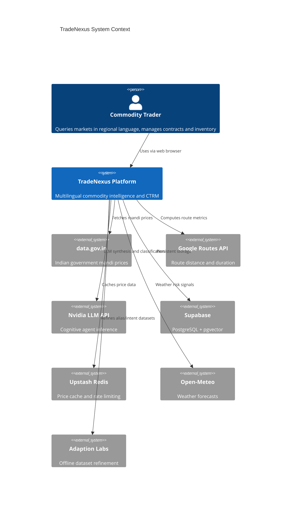

---

## Design Principles

### 1. Deterministic-First, Single-Pass LLM Synthesis

Statistical and rule-based agents perform all computationally intensive work without LLM calls. Structured telemetry from these agents is aggregated and passed to exactly one cognitive agent for final synthesis. This pattern reduces average response latency from multi-second multi-LLM chains to sub-second for cache hits and under 3 seconds for full cognitive flows.

### 2. Graceful Degradation

Every external dependency has a fallback path:

| Dependency | Fallback Behavior |
|---|---|
| data.gov.in | Mock mandi price data |
| Google Routes | Pre-seeded corridor database with deterministic scoring |
| Nvidia LLM | Mock provider for offline development |
| Supabase unavailable | Frontend demo data from `apps/web/src/data/demo.js` |

### 3. Closed-Loop Learning

Runtime resolution misses and user corrections are captured as structured feedback events. An offline pipeline submits these to Adaption Labs for clustering and refinement, then re-imports improved alias and intent mappings.

### 4. Session-Aware Conversational AI

LUCY maintains per-session message history, context variables, and inventory snapshots. Pronoun resolution ("isko", "wahan", "us mandi mein") uses conversation history rather than stateless query processing.

---

## System Context

```
                         ┌─────────────────────────────────┐
                         │         Commodity Trader         │
                         │   (Browser — EN/HI + Voice)      │
                         └───────────────┬─────────────────┘
                                         │ HTTPS
                         ┌───────────────▼─────────────────┐
                         │      Vercel — React Frontend     │
                         │  tradenexus.vercel.app           │
                         └───────────────┬─────────────────┘
                                         │ REST /api/v1/*
                         ┌───────────────▼─────────────────┐
                         │      FastAPI Backend             │
                         │  14 Routers · 20 Agents          │
                         │  APScheduler · Session Manager     │
                         └───┬───────┬───────┬───────┬──────┘
                             │       │       │       │
              ┌──────────────┘       │       │       └──────────────┐
              ▼                      ▼       ▼                      ▼
        ┌──────────┐          ┌──────────┐ ┌──────────┐      ┌──────────┐
        │ Supabase │          │  Upstash │ │ External │      │   ML     │
        │ Postgres │          │  Redis   │ │   APIs   │      │  Models  │
        │pgvector  │          │  4h TTL  │ │          │      │  Local   │
        │ pg_trgm  │          └──────────┘ └──────────┘      └──────────┘
        └──────────┘
```

---

## Component Architecture

### Frontend Layer (`apps/web/`)

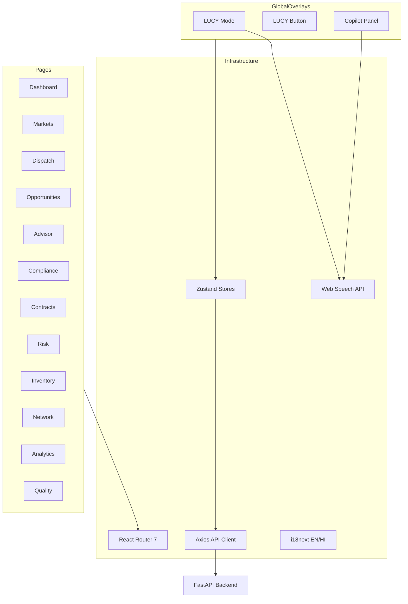

| Component | Path | Responsibility |
|---|---|---|
| App shell | `components/layout/AppLayout.jsx` | Sidebar navigation, top bar, page layout |
| LUCY OS | `components/lucy/` | Global NL operating system with voice/text |
| Copilot | `components/copilot/` | Page-context voice assistant with execution timeline |
| API client | `lib/api.js` | Centralized Axios instance with error handling |
| State | `store/` | Global auth, copilot, and LUCY session stores |
| Demo fallback | `data/demo.js` | Static data when API endpoints are unavailable |

### Backend Layer (`services/api/`)

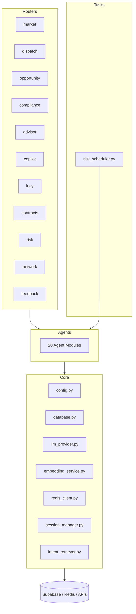

| Module | Path | Responsibility |
|---|---|---|
| Entry point | `main.py` | FastAPI app, CORS, router registration, scheduler lifecycle |
| Routers | `routers/` | 14 REST endpoint groups under `/api/v1/` |
| Agents | `agents/` | 20 specialized agent implementations |
| Core | `core/` | Shared infrastructure (DB, LLM, embeddings, Redis, sessions) |
| Data ingestion | `data_ingestion/` | data.gov.in and Google Routes API clients |
| Tasks | `tasks/risk_scheduler.py` | APScheduler background jobs |

---

## Agent Framework

### Agent Inventory

| Agent | File | Tier | Primary Function |
|---|---|---|---|
| Commodity Intelligence | `commodity_agent.py` | Hybrid | 4-tier multilingual name resolution |
| Market | `market_agent.py` | Deterministic | Price analysis, anomaly detection, ingestion |
| Dispatch | `dispatch_agent.py` | Deterministic | Corridor scoring via Google Routes + DB |
| Opportunity | `opportunity_agent.py` | Deterministic | Arbitrage spread and net-margin calculation |
| Compliance | `compliance_agent.py` | Cognitive | APMC/FSSAI/GST permit extraction (LLM) |
| Trade Advisor | `trade_advisor_agent.py` | Cognitive | Multi-agent telemetry synthesis (LLM) |
| Intent Classifier | `intent_classifier.py` | Hybrid | Copilot intent routing (rules + LLM) |
| LUCY Orchestrator | `lucy_orchestrator.py` | Cognitive | 21-intent NL OS with session context |
| Inventory | `inventory_agent.py` | Deterministic | Stock CRUD against `user_inventory` |
| Buyer Discovery | `buyer_discovery_agent.py` | Deterministic | Geographic buyer ranking |
| Contract | `contract_agent.py` | Hybrid | Contract lifecycle and field-note parsing |
| Risk | `risk_agent.py` | Deterministic | MtM, portfolio risk, concentration alerts |
| Weather | `weather_agent.py` | Deterministic | Open-Meteo forecasts and transit risk |
| Macro Signal | `macro_signal_agent.py` | Cognitive | Daily commodity sentiment (LLM) |
| ML Inference | `ml_inference_agent.py` | Hybrid | LSTM/Prophet/XGBoost/Chronos forecasts |
| Ingestion | `ingestion_agent.py` | Hybrid | PDF/image OCR + LLM extraction |
| Invoice Generator | `invoice_generator.py` | Deterministic | GST invoice computation |
| Counterparty | `counterparty_agent.py` | Deterministic | Counterparty risk scoring |

### Agent Orchestration — Trade Recommendation

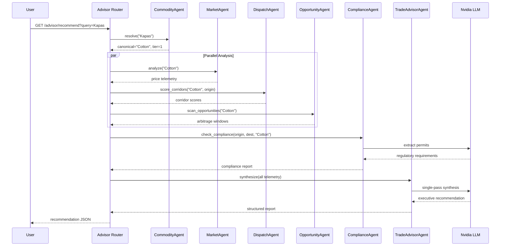

### Agent Orchestration — LUCY Natural Language OS

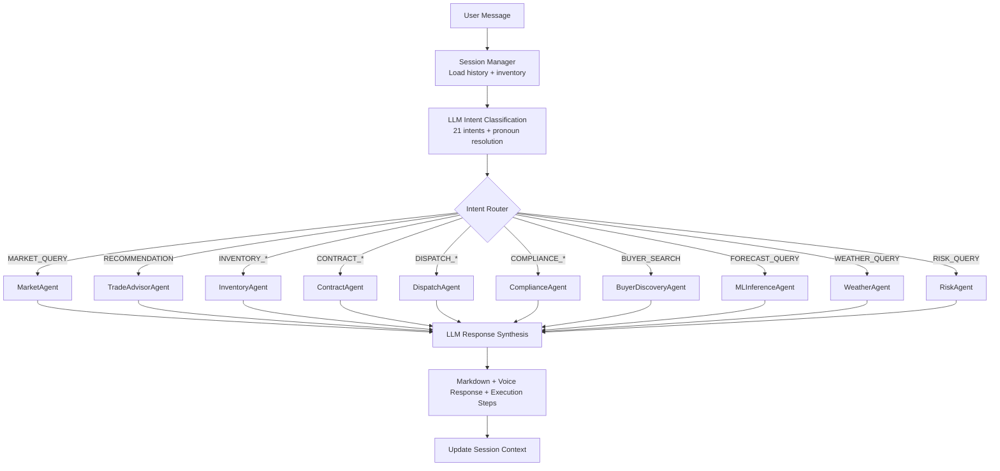

---

## Conversational AI Layers

TradeNexus exposes three distinct AI interaction layers, each optimized for a different use case:

```
┌─────────────────────────────────────────────────────────────────────┐
│                        AI Interaction Layers                         │
├─────────────────┬─────────────────────┬─────────────────────────────┤
│  Trade Advisor  │      Copilot        │           LUCY              │
├─────────────────┼─────────────────────┼─────────────────────────────┤
│ One-shot query  │ Page-context voice  │ Global NL operating system  │
│ Structured JSON │ 8 intents           │ 21 intents                  │
│ /app/advisor    │ CopilotPanel        │ LucyMode overlay            │
│ No session      │ Execution timeline  │ Session memory + pronouns   │
│ Fast path       │ TTS voice response  │ CTRM actions (create, sell) │
└─────────────────┴─────────────────────┴─────────────────────────────┘
```

| Layer | Endpoint | Intent Count | Session | Voice |
|---|---|---|---|---|
| Trade Advisor | `GET /api/v1/advisor/recommend` | N/A (direct query) | Stateless | No |
| Copilot | `POST /api/v1/copilot/process` | 8 | Per-request | Yes (TTS text) |
| LUCY | `POST /api/v1/lucy/chat` | 21 | Persistent | Yes (TTS text) |

All three layers ultimately route classified intents to the same underlying agent pool. The difference is classification depth: Copilot uses 8 coarse intents with rule-based fast-path; LUCY uses 21 fine-grained CTRM intents with session-aware LLM classification; both can be augmented by the RAG layer described below.

---

## Retrieval-Augmented Intent Classification (RAG)

TradeNexus implements **Retrieval-Augmented Generation (RAG)** for multilingual intent classification. Rather than relying on a zero-shot LLM prompt alone, the system retrieves semantically similar utterances from a curated corpus and injects them as few-shot examples before classification. This grounds intent decisions in real trader language patterns across Indian dialects.

### End-to-End RAG Pipeline

```
User Query (any language / Hinglish)
        │
        ▼
┌───────────────────┐
│  Query Embedding  │  paraphrase-multilingual-MiniLM-L12-v2 → 384-dim vector
└─────────┬─────────┘
          │
          ▼
┌───────────────────┐
│  Vector Search    │  pgvector cosine similarity on intent_examples
│  (top-k = 3)      │  RPC: match_intent_examples
└─────────┬─────────┘
          │
          ▼
┌───────────────────┐
│ Similar Examples  │  utterance + intent + entities + similarity score
└─────────┬─────────┘
          │
          ▼
┌───────────────────┐
│ Few-Shot Context  │  build_rag_context() → prompt injection block
└─────────┬─────────┘
          │
          ▼
┌───────────────────┐
│ Intent            │  Rule-based fast-path OR RAG-augmented LLM classification
│ Classification    │  (Copilot: 8 intents | LUCY: 21 intents)
└─────────┬─────────┘
          │
          ▼
┌───────────────────┐
│ Agent Routing     │  intent → specialized agent(s) → structured response
└───────────────────┘
```

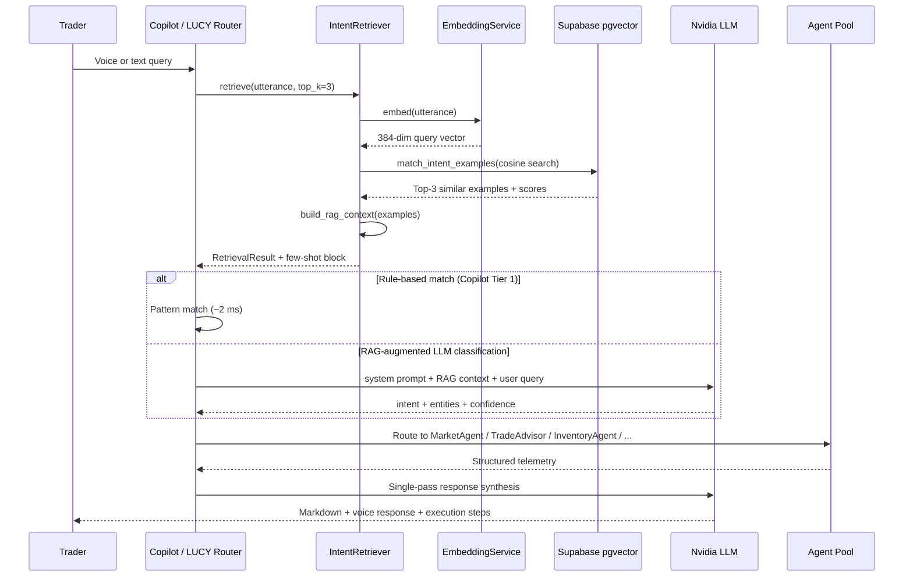

### Multilingual Intent Corpus

TradeNexus generated and refined a **multilingual intent corpus of 1,632 examples** covering **9 Indian languages and Hinglish**, distributed across **30 intent categories** spanning inventory, contracts, market, dispatch, risk, buyers, compliance, and deal evaluation.

| Language Code | Language | Example Utterance |
|---|---|---|
| `hi` | Hindi | "cotton ka bhav kya hai aaj?" |
| `mr` | Marathi | "kaapus cha bhav kaa aahe?" |
| `gu` | Gujarati | "kapas no bhav shu che?" |
| `te` | Telugu | "patti yokka bhav enti?" |
| `ta` | Tamil | "paruthi vilai enna?" |
| `pa` | Punjabi | "kapaah da rate ki hai?" |
| `bn` | Bengali | "tula'r daam koto?" |
| `kn` | Kannada | "hatti bele eshtu?" |
| `en` | English | "What is the price of cotton today?" |
| `hi-en` | Hinglish | "mere gehu ki total value kya hai" |

Each record in `intent_examples` stores:

| Field | Purpose |
|---|---|
| `utterance` | Raw trader query in native script or Latin transliteration |
| `utterance_embedding` | 384-dim vector for pgvector retrieval |
| `intent` | Canonical intent label (e.g., `market_price_query`, `inventory_add`) |
| `intent_category` | Grouping: Inventory, Market, Dispatch, Risk, Contracts, etc. |
| `entities` | Extracted JSON: commodity, quantity, origin, destination |
| `action` | Target agent action metadata for routing |
| `difficulty` | simple / moderate / ambiguous — for corpus quality tracking |

### Corpus Build Pipeline

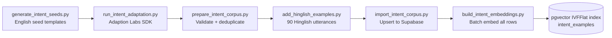

The Adaption Labs pipeline expands English seed templates into dialect-accurate regional variants, producing the final 1,632-example corpus before embedding and index build.

### IntentRetriever Implementation

Core module: `services/api/core/intent_retriever.py`

| Step | Method | Detail |
|---|---|---|
| 1. Normalize | `normalize_utterance()` | Lowercase, strip punctuation (preserves Unicode script) |
| 2. Embed | `embedding_service.embed()` | Cross-lingual encoding — Hindi query matches Hindi corpus entries |
| 3. Search | `supabase.rpc("match_intent_examples")` | Cosine similarity, returns top-k × 3 candidates |
| 4. Filter | Similarity threshold ≥ 0.45 | Drops low-confidence matches |
| 5. Rank | Sort by similarity DESC, limit top_k | Computes `dominant_intent` via majority vote |
| 6. Inject | `build_rag_context()` | Formats few-shot block for LLM classifier prompt |

**Fallback path:** If the Supabase RPC is unavailable, `IntentRetriever` performs in-memory brute-force cosine search against all embedded rows — ensuring RAG works in local development without full RPC setup.

### Intent Classification Tiers

TradeNexus uses a layered classification strategy that combines speed with RAG-augmented accuracy:

```
┌─────────────────────────────────────────────────────────────────────┐
│                    Intent Classification Stack                       │
├─────────────────────────────────────────────────────────────────────┤
│  Tier 1 — Rule-Based Fast-Path (Copilot)              ~2 ms       │
│    Regex patterns for Hindi / Hinglish / English keywords           │
│    price_check · recommendation · route_check · compliance · ...  │
├─────────────────────────────────────────────────────────────────────┤
│  Tier 2 — RAG Retrieval                                 ~40 ms      │
│    Embed query → pgvector search → top-3 similar examples           │
│    Dominant intent vote + retrieval_confidence score                │
├─────────────────────────────────────────────────────────────────────┤
│  Tier 3 — RAG-Augmented LLM Classification              ~800 ms     │
│    Few-shot examples injected into Nvidia LLM prompt                │
│    Entity extraction: commodity, origin, destination, quantity      │
├─────────────────────────────────────────────────────────────────────┤
│  Tier 4 — Session-Aware LLM (LUCY only)                 ~1.2 s      │
│    Conversation history + inventory snapshot + pronoun resolution   │
│    21-intent taxonomy with structured JSON output                   │
└─────────────────────────────────────────────────────────────────────┘
```

When RAG retrieval confidence exceeds the similarity threshold, the dominant intent from retrieved examples provides a strong prior for the LLM classifier, reducing misclassification on dialect-heavy or code-mixed queries.

### Agent Routing Map

Once intent is classified, the router dispatches to one or more specialized agents:

| Intent Category | Example Intents | Routed Agent(s) |
|---|---|---|
| Inventory | `inventory_add`, `inventory_query`, `inventory_sell` | InventoryAgent → CommodityAgent |
| Market | `market_price_query`, `market_trend_query`, `market_forecast_query` | MarketAgent → MLInferenceAgent (forecast) |
| Dispatch | `dispatch_route_query`, `dispatch_create`, `dispatch_status_query` | DispatchAgent |
| Contracts | `contract_create_buy`, `contract_status_query` | ContractAgent → CommodityAgent |
| Risk | `risk_pnl_query`, `risk_alert_query`, `risk_portfolio_query` | RiskAgent → MLInferenceAgent |
| Buyers | `find_buyers`, `buyer_profile_query` | BuyerDiscoveryAgent |
| Compliance | `compliance_invoice`, `compliance_gst_query` | ComplianceAgent |
| Deal | `deal_evaluate`, `deal_negotiation_range` | TradeAdvisorAgent (parallel agent orchestration) |
| Context | `greeting`, `alias_correction`, `session_summary_request` | CommodityAgent / LUCY synthesis |

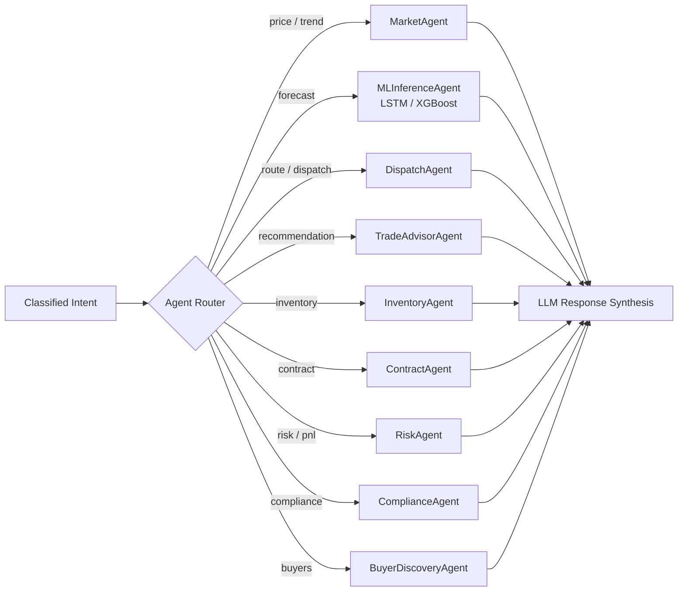

Copilot implements this routing explicitly in `services/api/routers/copilot.py` via intent handler functions (`_handle_price_check`, `_handle_recommendation`, `_handle_route_check`, etc.). LUCY implements equivalent routing in `LucyOrchestrator.process_turn()` with a 21-intent switch and parallel agent invocation.

---

## Multilingual NLP and Embeddings

TradeNexus applies multilingual NLP at two distinct vector-indexed layers, both powered by the same embedding model:

```
┌─────────────────────────────────────────────────────────────────────┐
│              Shared Embedding Model (Local, Zero API Cost)           │
│         paraphrase-multilingual-MiniLM-L12-v2  ·  384 dimensions     │
├──────────────────────────────┬──────────────────────────────────────┤
│  Commodity Alias Index       │  Intent Example Index                 │
│  commodity_aliases.embedding │  intent_examples.utterance_embedding  │
│  639+ regional crop names    │  1,632 trader utterances              │
│  Tier 3 of resolution        │  RAG retrieval for classification     │
│  cascade                     │                                       │
└──────────────────────────────┴──────────────────────────────────────┘
                              │
                    Supabase pgvector (IVFFlat)
```

### EmbeddingService

Module: `services/api/core/embedding_service.py`

| Capability | Detail |
|---|---|
| Model | `paraphrase-multilingual-MiniLM-L12-v2` via sentence-transformers |
| Dimensions | 384 |
| Loading | Lazy-loaded singleton on first encode — no startup penalty |
| Single encode | `embed(text)` → numpy vector |
| Batch encode | `embed_batch(texts)` — batch size 64 for index rebuilds |
| Cross-lingual | Hindi query "kapas ka bhav" matches English corpus entry "cotton price" via shared semantic space |
| Index write | `index_alias()` / `index_all_unembedded()` for commodity aliases |
| Search | `search_similar()` via `match_commodity_aliases` RPC |

### Why Multilingual Embeddings Matter

Indian commodity traders do not query in a single language. A platform that tokenizes English-only inputs fails on:

- Devanagari script queries: "कपास का भाव"
- Latin transliterations: "kapas ka bhav kya hai"
- Code-mixed Hinglish: "cotton bechna hai 100 quintal Nagpur se"
- Regional dialect variants: "kaapus cha bhav" (Marathi), "patti yokka bhav" (Telugu)

The multilingual MiniLM model maps all of these into a shared 384-dimensional semantic space, enabling both commodity resolution and intent retrieval without language-specific preprocessing pipelines.

---

## Linguistic Resolution Cascade

The Commodity Intelligence Agent implements a 4-tier resolution cascade designed to resolve 95%+ of queries without LLM invocation:

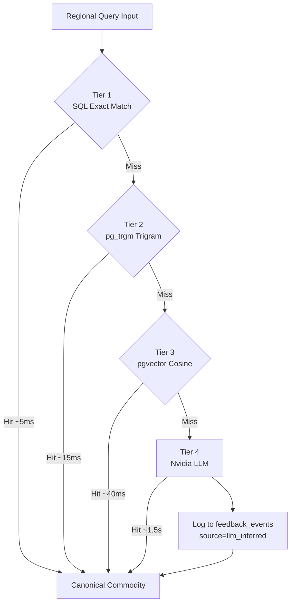

### Tier Details

| Tier | Mechanism | Index | Latency Target |
|---|---|---|---|
| 1 | Case-insensitive exact match on `commodity_aliases.alias_text` | B-tree | ~5 ms |
| 2 | Trigram similarity via `pg_trgm` extension | GIN (`gin_trgm_ops`) | ~15 ms |
| 3 | Cosine similarity on 384-dim embeddings | IVFFlat (`vector_cosine_ops`) | ~40 ms |
| 4 | Nvidia `qwen/qwen3.5-397b-a17b` with commodity context prompt | N/A | ~1.5 s |

**Embedding pipeline:**
1. Query text encoded locally via `sentence-transformers/paraphrase-multilingual-MiniLM-L12-v2`
2. Vector searched against `commodity_aliases.embedding` column
3. Index rebuilt via `services/api/scripts/build_embedding_index.py` after alias imports

---

## Data Flow Diagrams

### Mandi Price Ingestion Flow

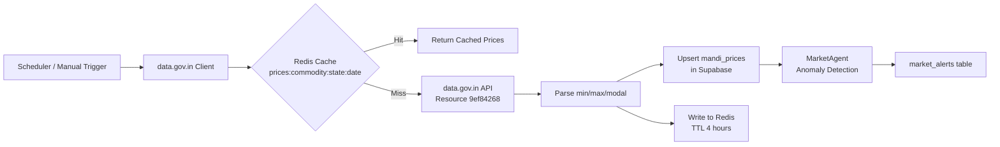

### Document Ingestion Flow

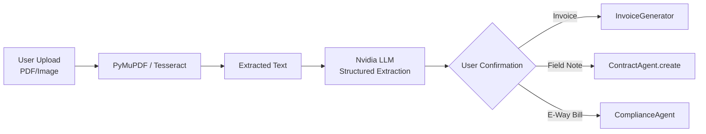

### Feedback and Learning Loop

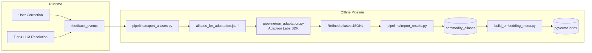

---

## CTRM Module Architecture

The Commodity Trading and Risk Management module spans contracts, dispatches, inventory, P&L, and counterparty management:

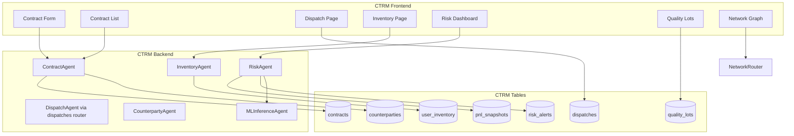

### Contract Lifecycle States

```
draft ──► confirmed ──► dispatched ──► delivered ──► settled
  │                        │
  └── cancelled ◄──────────┘
```

RiskAgent computes mark-to-market on state transitions and open positions, generating alerts for concentration breaches and adverse price movements.

---

## Risk and Forecasting Pipeline

TradeNexus combines classical time-series models (LSTM, XGBoost) with modern zero-shot forecasting (Chronos) inside a lazy-loaded inference agent. Forecasts are triggered by LUCY (`FORECAST_QUERY`), the Risk dashboard, and scheduled background scans.

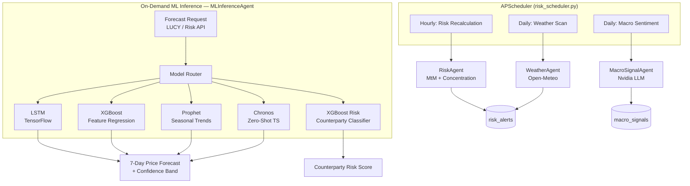

### LSTM — Sequence-Based Price Forecasting

| Parameter | Value |
|---|---|
| Framework | TensorFlow 2.15+ (Keras) |
| Training script | `services/ml/train_price_models.py` |
| Input window | 21 days of modal mandi prices |
| Output horizon | 7-day forward forecast |
| Architecture | Stacked LSTM layers with dropout |
| Per-commodity models | One `.h5` model + `.pkl` scaler per commodity |
| Artifacts | `data/ml_models/lstm_{commodity}.h5`, `scaler_{commodity}.pkl` |
| Inference | Lazy-loaded on first `FORECAST_QUERY` — zero models in memory at startup |

LSTM captures short-term price momentum and autocorrelation patterns in mandi price sequences. It is the primary model for commodities with sufficient historical depth (Cotton, Soybean, Wheat, Onion, etc.).

### XGBoost — Feature-Based Price and Risk Models

TradeNexus uses XGBoost in two distinct roles:

**1. Price forecasting (`xgboost_price_{commodity}.pkl`)**

| Feature | Description |
|---|---|
| Lag prices | t-1, t-7, t-14, t-21 day modal prices |
| Rolling statistics | 7-day and 21-day moving averages and standard deviation |
| Seasonal indicators | Month, week-of-year encoding |
| Target | 7-day forward modal price |

Trained via `services/ml/train_price_models.py`. Handles non-linear feature interactions that LSTM may miss on sparse or volatile commodities.

**2. Counterparty risk classification (`xgboost_default_model.pkl`)**

| Feature | Description |
|---|---|
| Contract history | Volume, frequency, default events |
| Payment patterns | Days-to-settle, dispute rate |
| Target | Binary default risk probability |

Trained via `services/ml/train_default_model.py`. Loaded by `MLInferenceAgent` for counterparty risk scoring in the Risk module.

### Model Registry and Inference

| Model | Framework | Training Script | Primary Use Case |
|---|---|---|---|
| **LSTM** | TensorFlow 2.15+ | `train_price_models.py` | 7-day price sequence forecast |
| **XGBoost** | xgboost 2.0+ | `train_price_models.py` | Feature-based price regression |
| **XGBoost Risk** | xgboost 2.0+ | `train_default_model.py` | Counterparty default probability |
| Prophet | prophet 1.1+ | `train_price_models.py` | Seasonal trend decomposition |
| LightGBM | lightgbm 4.0+ | `train_price_models.py` | Gradient boosting alternative |
| Chronos | transformers + torch | Lazy-loaded at inference | Zero-shot time-series (cold-start commodities) |

All models are registered in `data/ml_models/model_registry.json` and lazy-loaded by `MLInferenceAgent` on first inference call. The agent selects the best available model per commodity based on registry metadata and falls back through the model stack if a commodity-specific artifact is missing.

### Forecast Request Flow

```
LUCY: "cotton ka price forecast kya hai?"
    │
    ▼
Intent: FORECAST_QUERY → MLInferenceAgent
    │
    ├── Load lstm_cotton.h5 + scaler_cotton.pkl (if available)
    ├── Else load xgboost_price_cotton.pkl
    ├── Else load Prophet or Chronos zero-shot
    │
    ▼
Fetch last 21 days mandi_prices from Supabase
    │
    ▼
Generate 7-day forecast + confidence interval
    │
    ▼
LLM synthesizes natural language response with chart data
```

---

## Adaptive Learning Architecture

TradeNexus integrates **Adaption Labs** for offline refinement of two dataset types: commodity aliases and intent classification examples.

### Alias Adaptation

```
┌──────────────┐     ┌──────────────┐     ┌──────────────┐     ┌──────────────┐
│   Export     │────►│   Adapt      │────►│   Import     │────►│   Rebuild    │
│              │     │              │     │              │     │              │
│ Supabase +   │     │ Adaption     │     │ Upsert to    │     │ pgvector     │
│ feedback to  │     │ Labs SDK     │     │ commodity_   │     │ embedding    │
│ JSONL        │     │ clustering   │     │ aliases      │     │ index sync   │
└──────────────┘     └──────────────┘     └──────────────┘     └──────────────┘
```

**Feedback sources captured at runtime:**

| Source | Trigger | Stored As |
|---|---|---|
| User correction | `POST /api/v1/feedback/correction` | `commodity_aliases` with `source='user'` |
| LLM inference | Tier 4 cascade resolution | `feedback_events` with `source='llm_inferred'` |
| Adaption import | Pipeline import step | `commodity_aliases` with `source='adaptive_data'` |

### Intent Adaptation

TradeNexus builds the RAG intent corpus through a multi-stage pipeline that produces **1,632 validated examples** before embedding:

```
generate_intent_seeds.py          English seed templates (30 intent categories)
        │
        ▼
run_intent_adaptation.py          Adaption Labs SDK — regional language expansion
        │
        ▼
prepare_intent_corpus.py          Validate languages, deduplicate, clean
        │
        ▼
add_hinglish_examples.py          90 hand-crafted Hinglish utterances
        │
        ▼
import_intent_corpus.py           Upsert to intent_examples (Supabase)
        │
        ▼
build_intent_embeddings.py        Batch embed all rows → pgvector index
        │
        ▼
intent_retriever.py               Runtime RAG retrieval → few-shot LLM injection
```

### Learning Analytics

The dashboard exposes resolution tier breakdown via `GET /api/v1/feedback/stats`:

- Tier 1/2/3 hit rates (deterministic resolution)
- Tier 4 fallback frequency (LLM invocations)
- User correction count over time
- Alias corpus growth metrics

---

## Database Schema

### Entity Relationship Overview

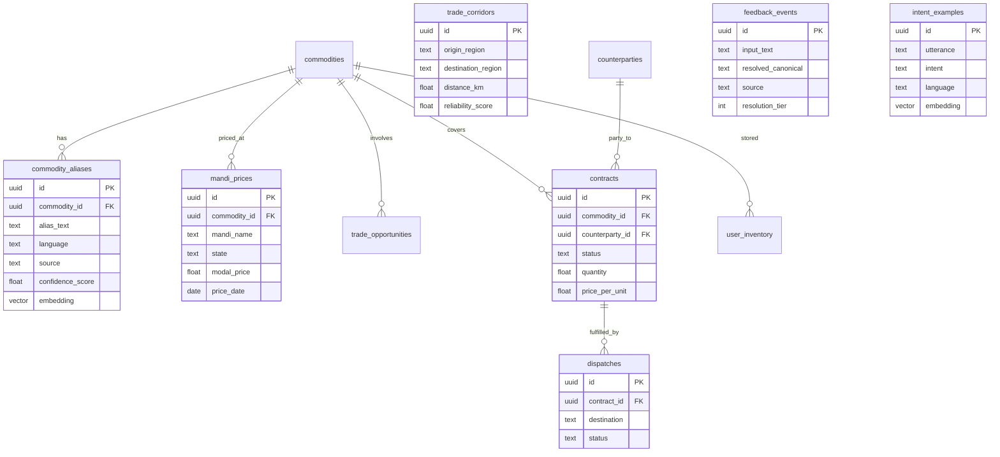

### Schema Files

| File | Tables | Purpose |
|---|---|---|
| `data/schema.sql` | 10 core tables | Commodities, aliases, prices, corridors, opportunities, feedback, inventory, buyers |
| `data/schema_ctrm.sql` | 8 CTRM tables | Counterparties, contracts, dispatches, P&L, quality, macro signals, risk alerts, agent activity |
| `data/schema_intent.sql` | 1 table | Intent examples with embeddings for RAG retrieval |

### PostgreSQL Extensions

| Extension | Purpose |
|---|---|
| `vector` | 384-dimensional embedding storage and cosine search |
| `pg_trgm` | Trigram fuzzy matching for Tier 2 alias resolution |

---

## Caching Strategy

| Cache Key Pattern | TTL | Storage | Purpose |
|---|---|---|---|
| `prices:{commodity}:{state}:{date}` | 4 hours | Upstash Redis | Mandi price API responses |
| Session data | In-memory | Python dict via SessionManager | LUCY conversation context |
| ML models | Lazy-loaded | Local filesystem | Avoid startup memory overhead |

Cache miss behavior: fetch from external API, persist to Supabase, write to Redis, return to caller.

---

## Background Schedulers

`services/api/tasks/risk_scheduler.py` registers APScheduler jobs on application startup:

| Job | Frequency | Agent | Output |
|---|---|---|---|
| Risk recalculation | Hourly | RiskAgent | Updated `pnl_snapshots`, `risk_alerts` |
| Weather corridor scan | Daily | WeatherAgent | Transit risk signals for active corridors |
| Macro sentiment scan | Daily | MacroSignalAgent | `macro_signals` for open contract commodities |

Manual trigger available via `POST /api/v1/risk/scan-now` (requires `INTERNAL_KEY`).

---

## External Service Integration

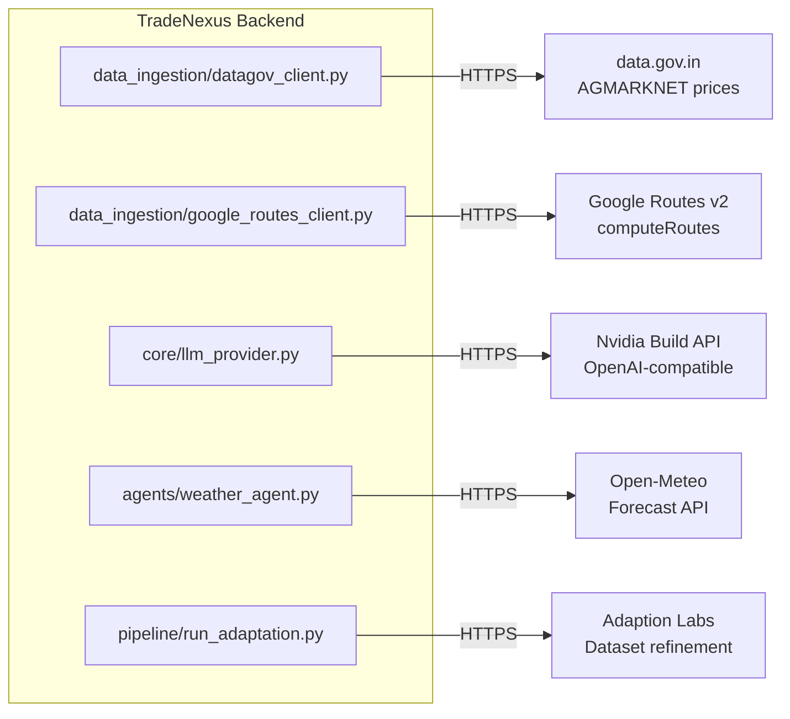

| Service | Client Module | Auth | Rate Limit Handling |
|---|---|---|---|
| data.gov.in | `datagov_client.py` | API key | Semaphore-based parallel fetch with Redis cache |
| Google Routes v2 | Google Routes client | API key | Fallback to seeded corridor DB |
| Nvidia LLM | `llm_provider.py` | Bearer token | Mock provider for development |
| Open-Meteo | `weather_agent.py` | None (free) | Daily batch scan only |
| Adaption Labs | `pipeline/run_adaptation.py` | API key | Offline batch; 30s poll interval |

---

## Deployment Topology

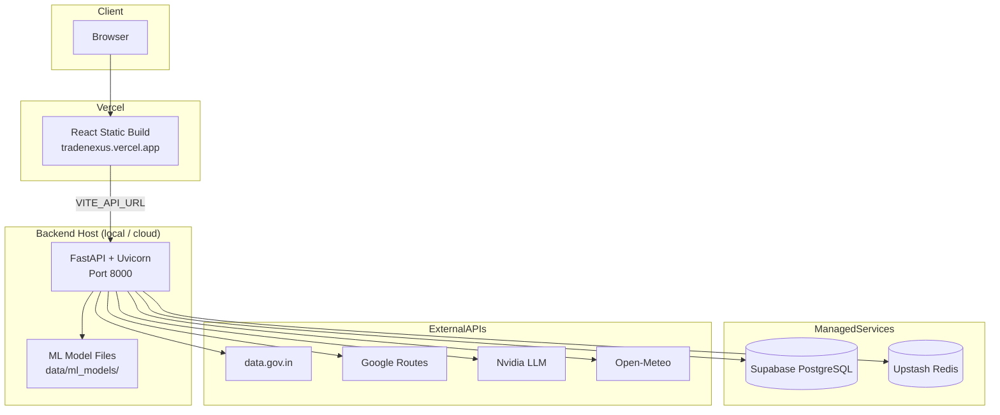

### CORS Configuration

Allowed origins (configured in `main.py`):
- `http://localhost:5173` (development)
- `http://127.0.0.1:5173` (development)
- `https://tradenexus.vercel.app` (production)

### Frontend Build

```bash
cd apps/web
npm run build    # Output: apps/web/dist/
```

Deploy `dist/` to Vercel with `VITE_API_URL` pointing to the production backend.

---

## Security and Resilience

| Concern | Implementation |
|---|---|
| Admin endpoints | Protected by `INTERNAL_KEY` header |
| API key management | Environment variables via pydantic-settings; never committed |
| Input validation | Pydantic v2 schemas on all router endpoints |
| Error handling | Graceful fallback to demo data on frontend; mock providers on backend |
| File upload | Multipart handling with size limits on compliance router |
| Database | Row-level security configurable via Supabase policies |

### Known Integration Notes

- Frontend inventory endpoints fall back to demo data when backend routes are unavailable
- `LLM_PROVIDER=mock` enables full UI testing without Nvidia API key
- `.env.example` uses `ANION_PUBLIC_KEY` / `SERVICE_ROLE_KEY`; application code reads `SUPABASE_KEY`

---

## Related Documentation

- [README.md](../README.md) — Project overview, setup, and feature summary
- [data/schema.sql](../data/schema.sql) — Core database schema
- [data/schema_ctrm.sql](../data/schema_ctrm.sql) — CTRM database schema
- [data/schema_intent.sql](../data/schema_intent.sql) — Intent RAG schema
